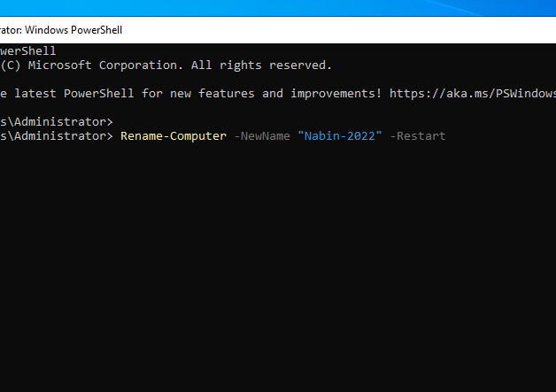
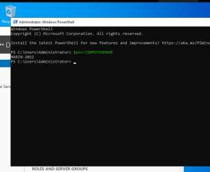
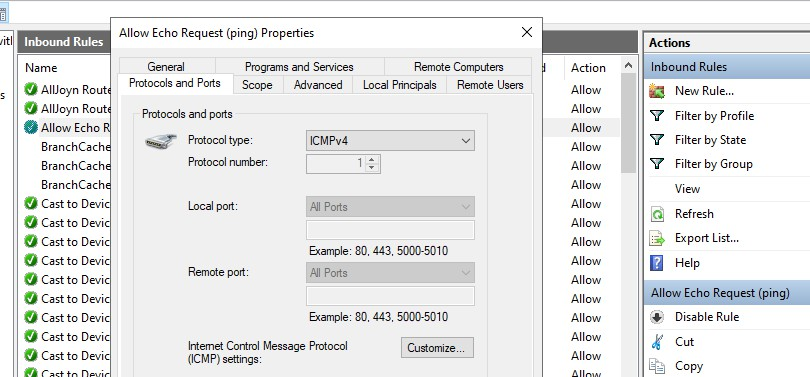
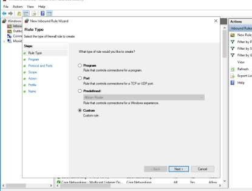
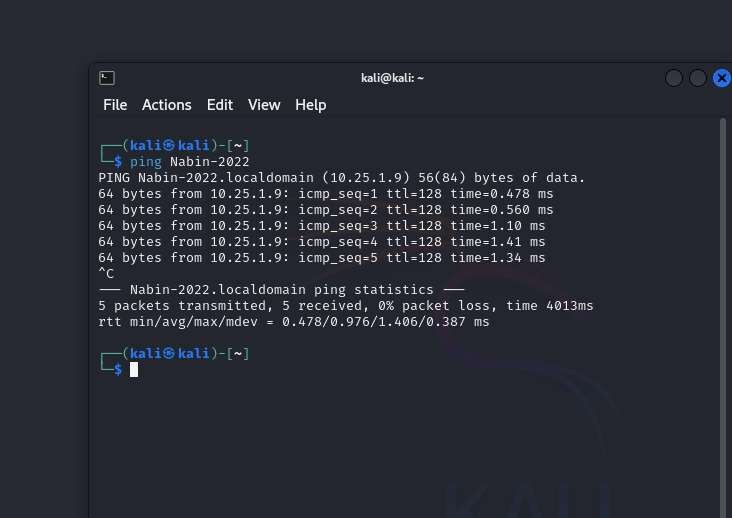

# Task 1: Server Identity & Host Firewall Configuration

## 1. Renaming the Server via PowerShell

A Windows Server 2022 VM was created and assigned a temporary default name during setup. Rather than using the GUI (System Properties), PowerShell was used to rename the server — a common real-world practice since it supports scripting, automation, and remote/unattended configuration.

Run with Administrator privileges:

```powershell
Rename-Computer -NewName "Nabin-2022" -Restart
```

This renames the server and restarts it automatically to apply the change.



## 2. Verifying the Server Name After Restart

Post-reboot, the hostname was verified from the command line rather than the GUI:

```powershell
$env:COMPUTERNAME
```

Output confirmed the new hostname: **`Nabin-2022`**.



## 3. Firewall Configuration — Allowing ICMP (Ping) Traffic

To support basic network connectivity testing, an inbound firewall rule was created in **Windows Defender Firewall with Advanced Security**:

| Setting | Value |
|---|---|
| Protocol | ICMPv4 |
| ICMP Type | Echo Request |
| Action | Allow the connection |
| Profiles | Domain, Private, Public |
| Rule Name | Allow Ping (Echo Request) |




## 4. Verifying Connectivity

After applying the rule, the server successfully responded to ping requests from another device on the network, confirming ICMP traffic was correctly permitted.


