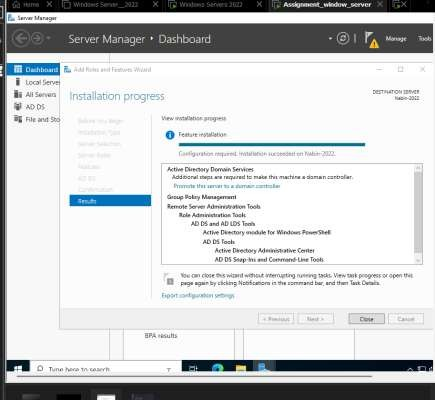
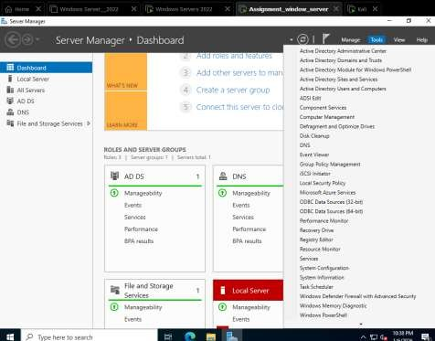
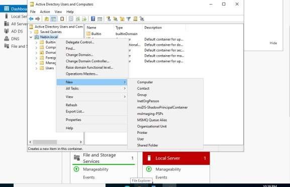
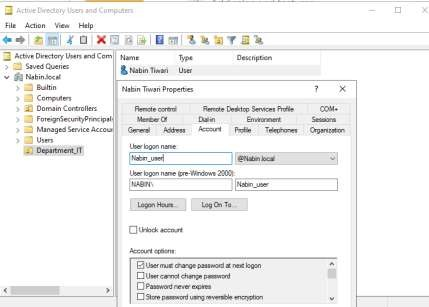
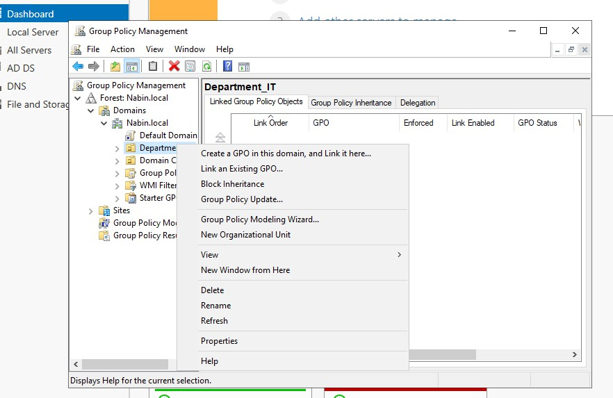
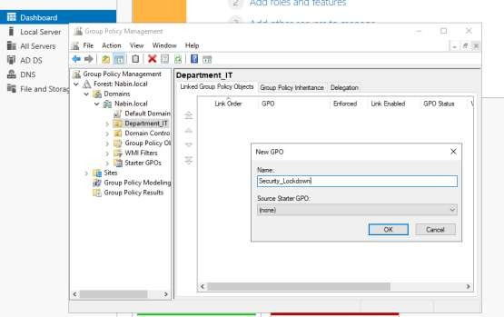
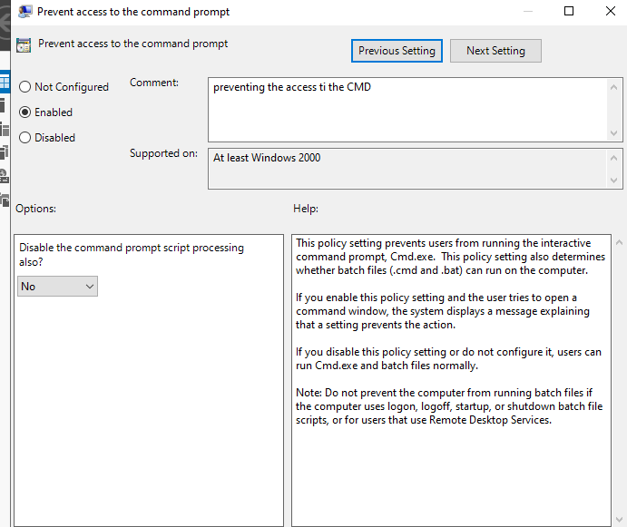

# Task 2: Active Directory Domain Services & Group Policy Management

## 1. Domain Setup and Promotion to Domain Controller

To centralize authentication and resource management, **`Nabin-2022`** was promoted to a Domain Controller:

1. Installed the **Active Directory Domain Services (AD DS)** role via Server Manager.
2. Promoted the server to a Domain Controller, creating a new forest: **`Nabin.local`**.
3. Set a **Directory Services Restore Mode (DSRM)** password to enable recovery access in case of failure.
4. Restarted the server to finalize the configuration.

## 2. Organizational Unit (OU) and User Creation

Using **Active Directory Users and Computers**:

- Created an OU named **`Department_IT`** to logically group IT department objects and simplify policy scoping.
- Created a user account **`Nabin_User`** inside that OU, with **"User must change password at next logon"** enabled for baseline account security.

## 3. Group Policy Object (GPO) Creation and Configuration

A GPO named **`Security_Lockdown`** was created via **Group Policy Management** and linked to the `Department_IT` OU, so the policy applies only to users within that unit.

**Policy configured:**

| Field | Value |
|---|---|
| Policy Name | Prevent access to the command prompt |
| Path | User Configuration → Administrative Templates → System |
| Status | Enabled |

After the policy applied, users under `Department_IT` were no longer able to open Command Prompt — a simple but effective example of reducing the local attack surface for standard users via centralized policy instead of per-machine configuration.

