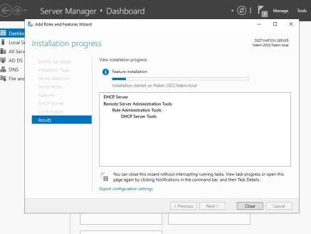
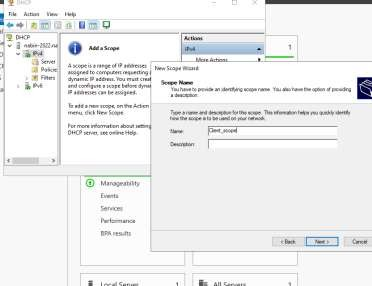
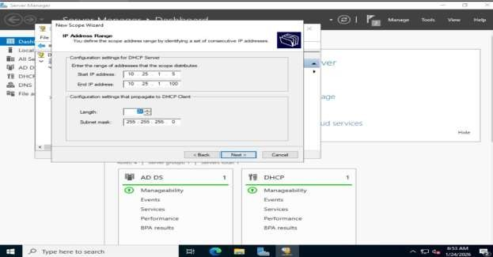
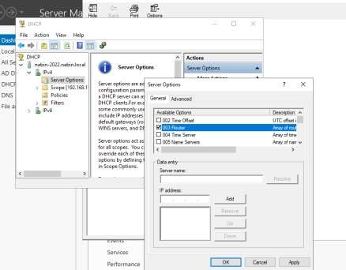
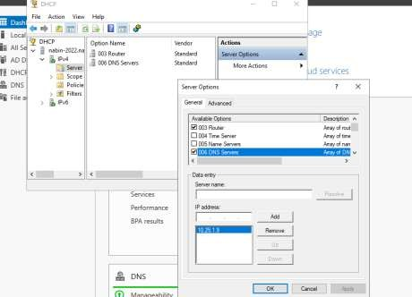
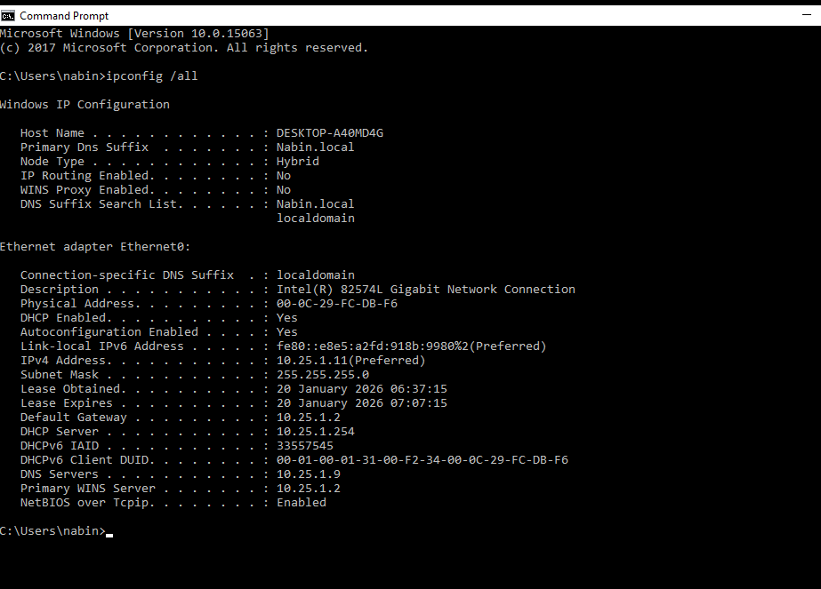
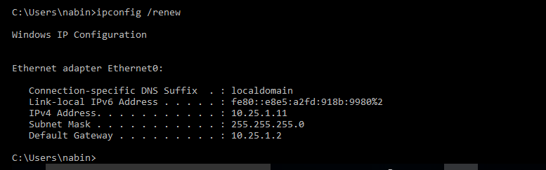
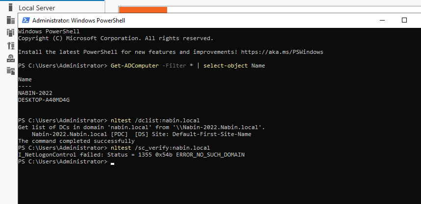

# Task 3: DHCP Configuration & Dynamic Addressing

## 1. DHCP Server Role Installation

The **DHCP Server** role was installed on **`Nabin-2022`** via Server Manager to enable automatic IP address assignment for client machines. After installation, post-deployment configuration was completed to **authorize the DHCP server in Active Directory** — a required step so the domain trusts the service to lease addresses.



## 2. Creation of the IPv4 Scope

A new scope, **`Client_Scope`**, was created to define the pool of addresses available to client devices:

| Setting | Value |
|---|---|
| Scope Name | Client_Scope |
| Start IP Address | 192.168.10.50 |
| End IP Address | 192.168.10.100 |
| Subnet Mask | 255.255.255.0 |

Limiting the range reduces the risk of IP conflicts and reserves the remaining addresses in the subnet for servers and infrastructure devices.




## 3. DHCP Scope Options

**Option 003 — Router (Default Gateway)**
- Gateway Address: `192.168.10.1`
- Tells clients where to send traffic destined for other networks or the internet.

**Option 006 — DNS Server**
- DNS Server: static IP of `Nabin-2022`
- Ensures clients use the domain controller for DNS resolution, which is required for domain logon, AD communication, and Group Policy processing.




## 4. Client-Side Verification

On the client VM, the network adapter was set to **obtain an IP address automatically**, then verified via Command Prompt:

```cmd
ipconfig /renew
ipconfig /all
```

The client successfully received an IP address within the `192.168.10.50–192.168.10.100` scope, along with the correct subnet mask, default gateway, and DNS server — confirming the DHCP server was issuing complete and correct network configuration to domain clients.




